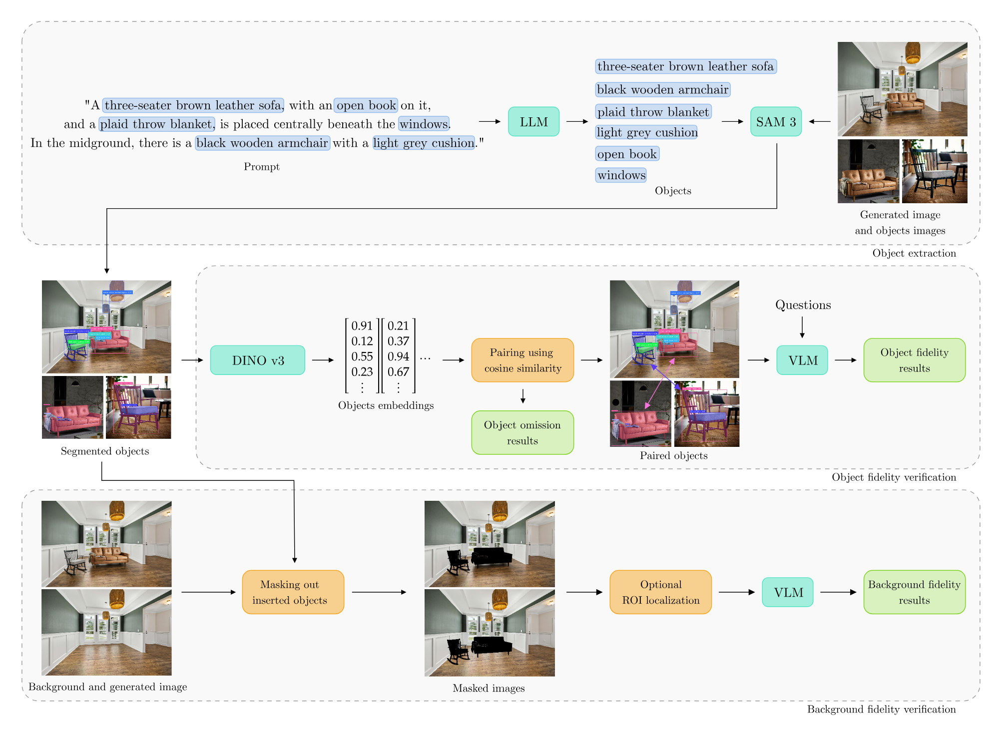

<div align="center">

# VIGIL: Tackling Hallucination Detection in Image Recontextualization

Joanna Wojciechowicz*, Maria Łubniewska*, Jakub Antczak*, Justyna Baczyńska*, Wojciech Gromski*, <br> Wojciech Kozłowski, Maciej Zięba <br>
(* denotes equal contribution)

Wroclaw University of Science and Technology

</div>



**Abstract:** We introduce VIGIL (**V**isual **I**nconsistency & **G**enerative **I**n-context **L**ucidity), the first benchmark dataset and framework providing a fine-grained categorization of hallucinations in the multimodal image recontextualization task for large multimodal models (LMMs). While existing research often treats hallucinations as a uniform issue, our work addresses a significant gap in multimodal evaluation by decomposing these errors into five categories: pasted object hallucinations, background hallucinations, object omission, positional & logical inconsistencies, and physical law violations. To address these complexities, we propose a multi-stage detection pipeline. Our architecture processes recontextualized images through a series of specialized steps targeting object-level fidelity, background consistency, and omission detection, leveraging a coordinated ensemble of open-source models, whose effectiveness is demonstrated through extensive experimental evaluations. Our approach enables a deeper understanding of where the models fail with an explanation; thus, we fill a gap in the field, as no prior methods offer such categorization and decomposition for this task. To promote transparency and further exploration, we openly release VIGIL, along with the detection pipeline and benchmark code, through our GitHub repository: https://github.com/mlubneuskaya/vigil and Data repository: https://huggingface.co/datasets/joannaww/VIGIL.

---

# VIGIL Pipeline: Quick Start Guide

## 1. Python Environment Setup

1.1. Create and activate a virtual environment:
```bash
python3 -m venv venv
source venv/bin/activate
```

1.2. Install required libraries:
```bash
pip install -r requirements.txt
```

## 2. Download Data from HuggingFace

2.1. Run the HuggingFace data download script:
```bash
python3 scripts/download_hf_data.py
```

- This will download datasets and place them in the `data/` directory.
- You may need to set up your HuggingFace token if prompted.

## 3. YAML Config Creation

Since the `configs/` and `jobs/` folders are git-ignored, you must create your own experiment config file. Here is a sample config:

Create a new file at `configs/example_experiment.yaml` with the following content:

```yaml
output_dir: outputs/example_run/

data_root: []
data_ids:
  "data/consumer_goods/data":
    - "0001"
    - "0002"
  
  "data/furniture/data":
    - "0001"
    - "0002"

qwen:
  model_name: Qwen/Qwen3-VL-8B-Instruct

segmentation:
  pairing_threshold: 0.3

background:
  device: cuda
  vlm_resolution: 1024
  batch_size: 16
  mask_margin_percent: 0.0
  absolute_difference_config:
    enabled: true

object_eval:
  resolution: 1024

```

- Adjust parameters as needed for your data and experiment.
- For full parameter descriptions, see [`src/configs/config_schema.py`](src/configs/config_schema.py).

## 4. Running the Pipeline

4.1. Run your experiment:

```bash
python3 main.py --config configs/example_experiment.yaml
```

## 5. Output and Logs

- Results are saved in the `outputs/` directory.
- Logs are in `outputs/logs/`.


